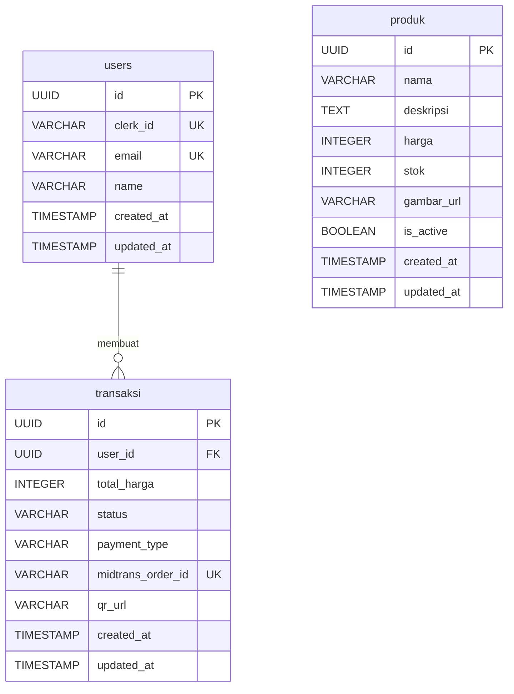

# ERD — Backend UMKM

## Entity Relationship Diagram



## Keterangan

| Tabel | Deskripsi |
|-------|-----------|
| `users` | Profil pengguna, sync dari Clerk webhook |
| `produk` | Katalog produk UMKM |
| `transaksi` | Order + payment QRIS, FK ke `users` |

## Status Transaksi

```
PENDING → PAID
PENDING → EXPIRED
PENDING → FAILED
```

## Catatan

- `users.clerk_id` unique index — satu Clerk account = satu user
- `transaksi.midtrans_order_id` unique — idempotency key untuk payment
- `transaksi.status` enum di level aplikasi: `PENDING`, `PAID`, `EXPIRED`, `FAILED`
- Relasi `produk` ke `transaksi` sengaja belum ada (item-level detail = minggu 3 jika perlu)
